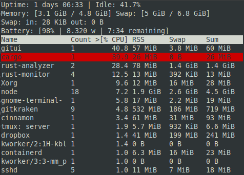

# Rust Monitor

A "top" like resource monitor written in Rust.

## Requirements

libcurses: `sudo apt-get install libncurses5-dev`

## Controls

- `ESC`: Exit.
- `<` and `>`: Change sorting.
- `g`: Toggle group by name.
